# ARM-Based-Piano
STM32 based digital piano project for EEE416 Microprocessor and Embedded Systems Laboratory

Demonstration video <a href="https://youtu.be/l-ic4qlintA">link</a>

<p align="center">
  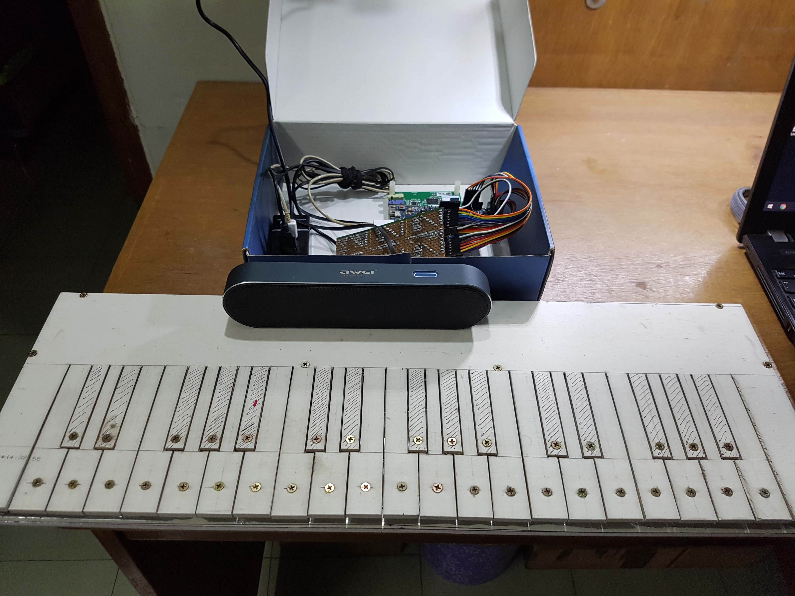
</p>

## Contents
- [Repository Overview](#repository-overview)
- [Materials Used](#materials-used)
- [Softwares Used](#softwares-used)
- [Useful Links](#useful-links)
- [Working Procedure](#working-procedure)
- [Resampling Implementation in MATLAB](#resampling-implementation-in-matlab)
- [Resampling Implementation in C](#resampling-implementation-in-c)
- [DAC Simulation and Design Using Proteus](#dac-simulation-and-design-using-proteus)
- [Keyboard Interfacing Using Arduino DUE and Interrupt](#keyboard-interfacing-using-arduino-due-and-interrupt)
- [STM32 Code](#stm32-code)
- [Conclusion](#conclusion)
- [Team](#team)

## Repository Overview
The repository directories include several folders for each component of the project. The purpose of each of the folders is listed here:

- **Solidworks Design** contains hardware design files that was used to build the PVC structure.
 
- **Arduino Due** folder contains the codes for the keyboard interfacing part of the piano. This board was used to read inputs from the 36 keys of the piano and send the keypress information to the STM32 board.

- **Matlab Simulation** folder contains resampling implementation and test codes for matlab. This was the first test for audio tone synthesis from a single note. Afterwards this code was ported to C.

- **C simulation** folder contains C-codes for audio resampling implementation which was directly used in the STM32 project code.

- **STM32** is the STM32CubeIDE project folder where the final implementation of SD-card reading, keyboard interfacing, audio synthesis and playback was implemented.

## Materials Used

- STM32F746 Discovery Board
- Arduino Due Board
- Arduino Uno Proto Shield
- Screws (for key contact + body)
- Female-Female jumpers (A lot!)
- 26 AWG wires (connects screws with circuit board)
- Aluminium foil (positive rail)
- 3.5mm headphone jack female
- Veroboard, soldering tools
- AWEI Y220 speaker with auxiliary cable
- Micro SD Card

## Softwares Used

- STM32CubeIDE
- Arduino IDE
- Proteus
- Matlab
- Codeblocks

## Useful Links

- <a href="https://www.youtube.com/playlist?list=PLc2rvfiptPSR0bzPjEsg5zmj0jvYMZLbV">A youtube playlist</a> containing useful videos for the STM32F746 Discovery Board

## Working Procedure


### Audio note synthesis from a single base note

A sample note of high resolution (44.1 KHz, 24 bit sample size) was downloaded. (The notes can be found at http://theremin.music.uiowa.edu/MISpiano.html). First we trimmed the note, and resampled it using MATLAB to see if the new note satisfies the frequency requirements of the target note. Then the resample function of MATLAB was manually written using resample theory (upsampling, interpolation using sinc function, downsampling). This code also generated similar notes, implying the correct operation of resample function. Finally the resampling function was ported to C code for using with STM32 board

<p align="center">
  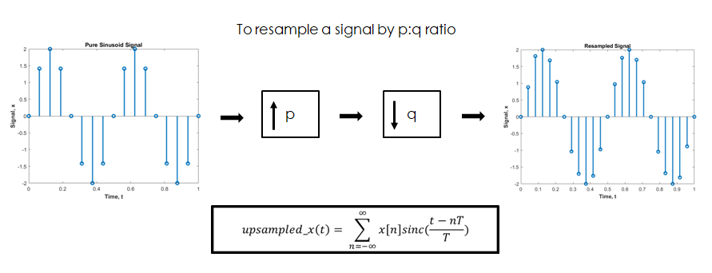
</p>

### Keyboard interfacing with a STM32 board

The designed hardware keyboard has 36 keys in total (3 octaves) and the keys are all connected to the Arduino DUE board (the STM32 discovery board did not have enough pins available as most of them were connected internally to other peripherals). Arduino DUE board reads the keypresses in polling mode with debouncing enabled. When a keypress is detected, DUE board sents an interrupt to the STM32 board along with the ID of the corresponding key being pressed.

### Note playback from STM32 board

The 36 piano notes are saved inside a micro SD card in binary format (8 kHz sampling rate, 8 bit resolution) and when a keypress is detected, the STM32 Discovery board reads the corresponding binary file, sends the audio samples to a buffer, and using the DAC circuit, these sample values are sent to the speaker device.

<p align="center">
  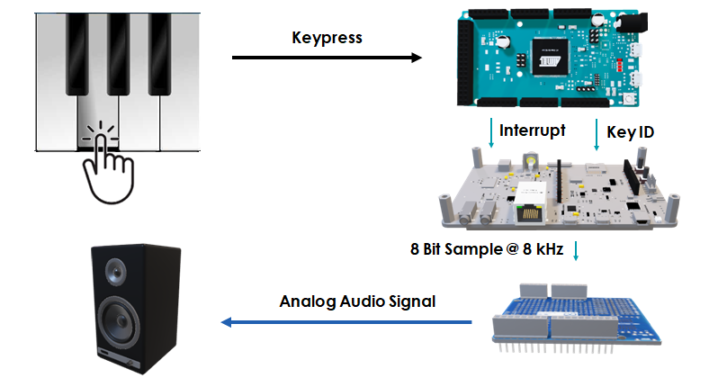
</p>


## Resampling Implementation in MATLAB
### Fundamentals:

In a conventional piano, there are 88 keys (A0-C8) that all produce tones of different frequency. These keys are divided into 8 octaves. Each octave has 12 steps.

An example of an octave is as follows: A0, A0#, B0, C1, C1#, D1, D1#, E1, F1, F1#, G1, G1#

Our task is to take one of these tones as our fundamental audio which we will then use to resample and generate the other audio tones of different frequencies.

In our project, we have decided to take A2 as our fundamental tone. It has a frequency of 110 Hz. Now, the other audio tones are related to the base frequency through the following equation:

f(n)=2^((n-25)/12)×110 Hz…………(1)

Here, n represents the number of the piano key. The number of the piano keys are also predetermined. The lowest frequency tone A0 corresponds to key 1 and the highest frequency tone C8 corresponds to key 88. Our base audio A2 has key 25. Through the relation in equation (1), we can determine the resampling ratio that is needed to generate any particular tone from A2.


### Resampling on sinusoidal signal:

Before we move on to how resampling is performed on the raw audio, it is easier to demonstrate the theory of resampling using a short pure sinusoid signal. Let us assume, we have a pure sinusoid of frequency 2 Hz and it has been sampled at a rate of 16 Hz. So the sampled signal looks as the following:

<p align="center">
  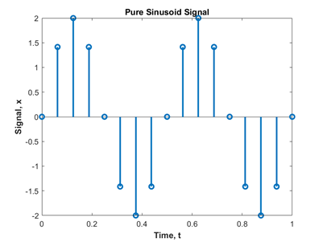
</p>


Our goal is to resample it at a ratio of 3:2. In order to do this, we need to,
Upsample the signal by 3. That means, (3-1) = 2 new samples will be inserted between every successive sample. Then downsample the signal by 2. That means, one sample is kept and the next is discarded.


### Upsampling

To Upsample the signal, we use the following equation of Sinc interpolation, 
upsampled_x(t)= ∑_(n=-∞)^∞▒〖x[n]sinc((t-nT)/T)〗

Here, x[n] is the original signal. It has a sampling period, T. We need to interpolate between two successive samples of ‘x’ and find out the extra sample values in between. The ‘t’ essentially represents the upsampled time axis. Now, we will visualize what’s happening with animation.

<p align="center">
  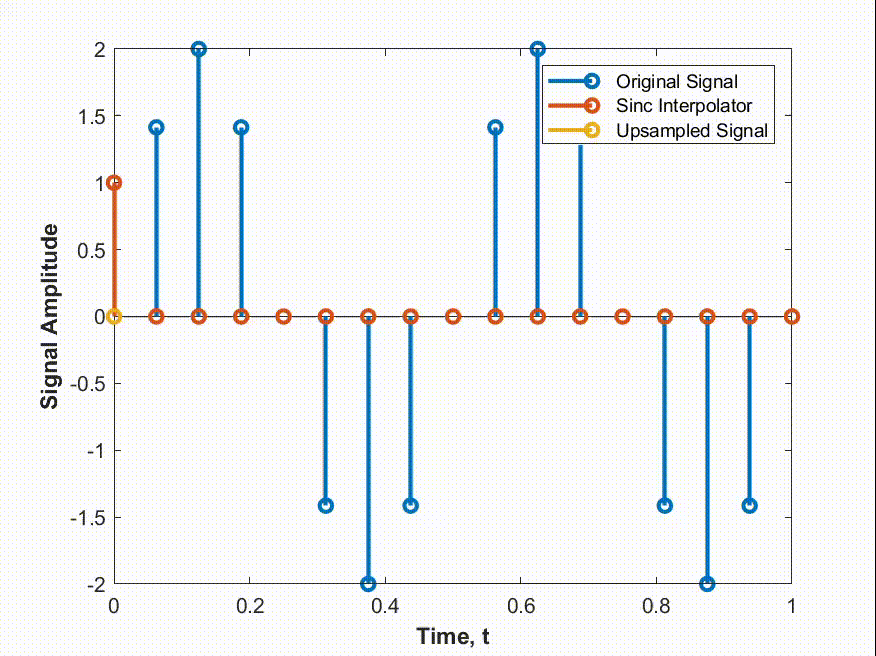
</p>


In this animation, the original signal is being upsampled by a factor of 3. So, 2 new samples are interpolated between any two successive samples. This interpolation is done through the use of a sinc function. As you can see, the sinc does a weighted averaging of the original signal at the new sampling instances. The amplitude of the upsampled signal at the original sampling instances remains the same as the sinc becomes zero everywhere else but the sampling instance.

### Code Snippet: 

``` C
void upsample()
{
    int k,j;
    double t_step,fs_u,b,sum;
    t_step = 1/fs;
    fs_u = fs*u;
    for(k=0; k<up_SIZE; k++)
    {
        b = (double)k/fs_u;
        sum = 0;
        for (j=0;j<SIZE;j++)
        {
          a[j] = (b/t_step) - j;
            if (a[j]!=0)           
                a[j] = sin(pi*a[j])/(pi*a[j]);
            else
                a[j] = 1;
            sum = sum + a[j]*x[j];
        }       up_x[k] = sum;
    }
}
```

### Downsampling: 
Downsampling refers to removing samples at a periodic interval from the upsampled signal. In the animation, we can see the that every alternate sample is being removed from the upsampled signal. The result is a signal downsampled by a factor of 2. 

<p align="center">
  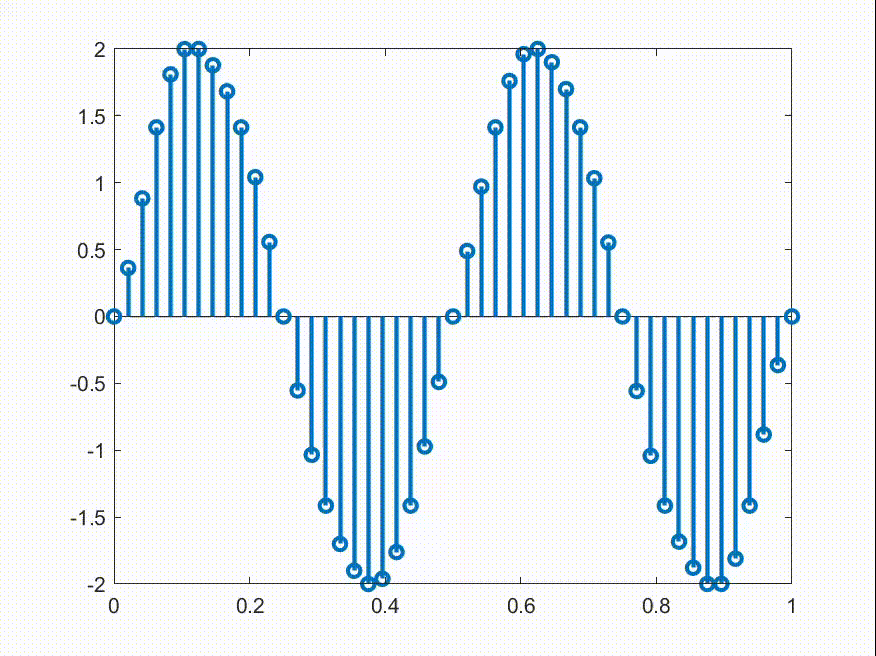
</p>


### Code Snippet:

``` C
void downsample()
{
    int k;
    for(k = 0; k<down_SIZE; k++)
    {
        down_x[k] = up_x[d*k];
    }
}

```

## Resampling Implementation in C
Now that we have an understanding of how to implement resampling in software, we need to make our code hardware compatible. To do this, we rewrite the same functions in C. The underlying principles are the same, so we are only going to show the code snippets.
### Code Snippets:
### Upsampling: 
### Downsampling:
However, there are some challenges in hardware implementation. These are listed as follows:
	Since any two consecutive audio tones are related to each other by a factor of 2^(1/12), so we have to approximate this irrational number to an integer ratio. But there are practical limitations on this ratio. Because we have limited memory on our microcontroller board, we cannot upsample the signal to any arbitrary ratio.
	Since our audio signal is large (64000 samples), we cannot perform resampling on the total signal at once because the upsampled signal becomes too large and does not fit into memory

### Solution to memory limitations:

The audio signal is broken up to equal sized slices. Resampling is performed on one slice at a time.

The signal slice after downsampling is then written to the external memory card

<p align="center">
  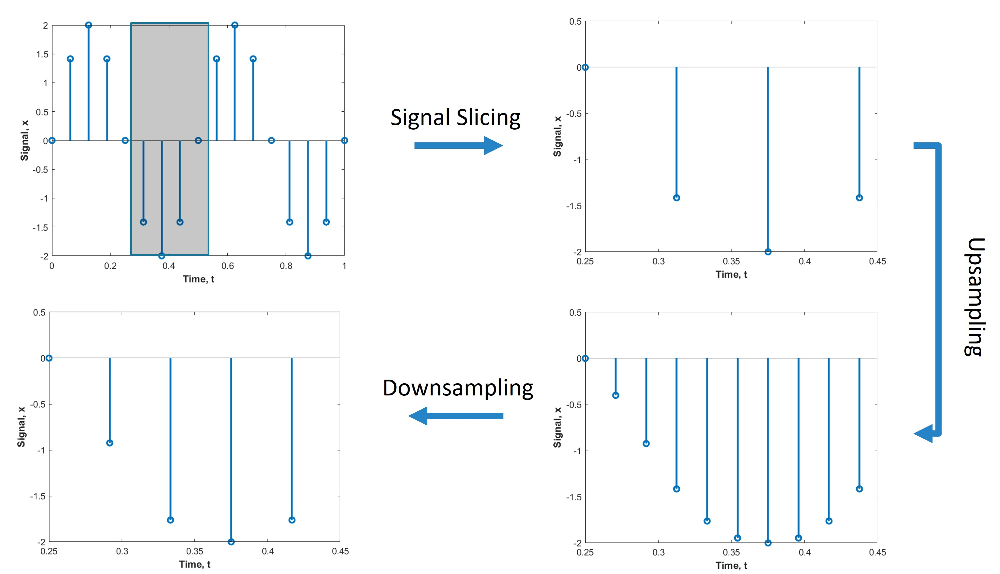
</p>

## Keyboard Interfacing Using Arduino DUE Interrupt

### Arduino DUE Connection with Keyboard Hardware

A hardware keyboard was prepared using 5mm PVC sheet. Each of the piano keys has a screw through them, and on the other side of each screw is a wire connecting it to a circuit board.
<p align="center">
  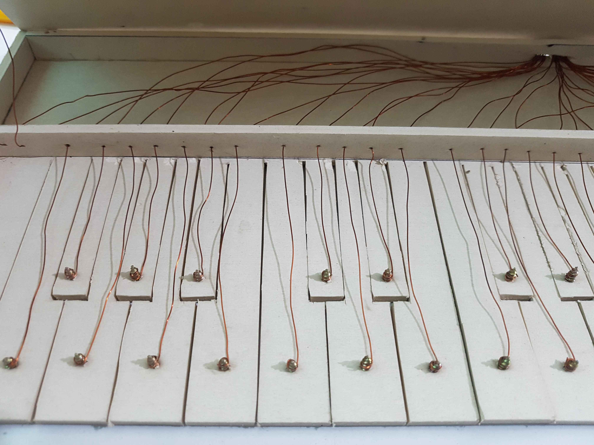
</p>

These keys are pulled down with a 10k resistor each.
<p align="center">
  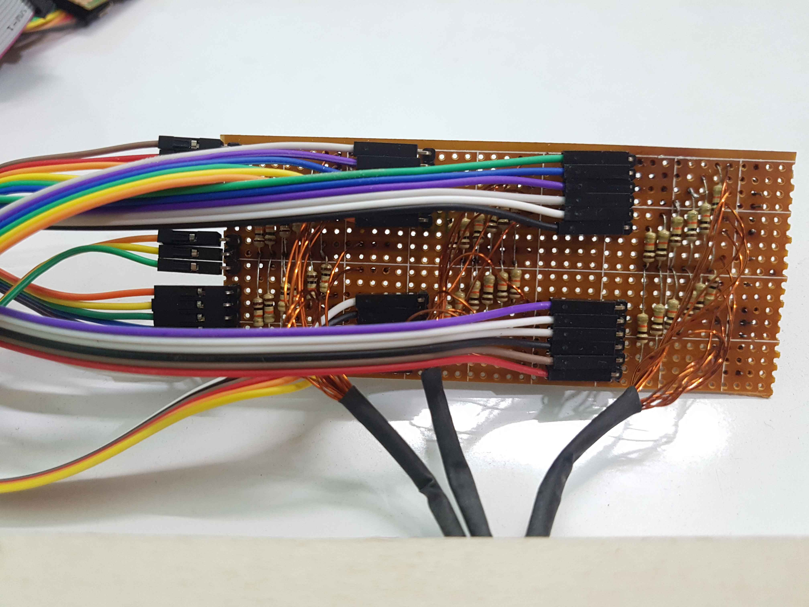
</p>

The bottom panel of the keyboad has aluminium foil body connected to positive terminal of the circuit board.
<p align="center">
  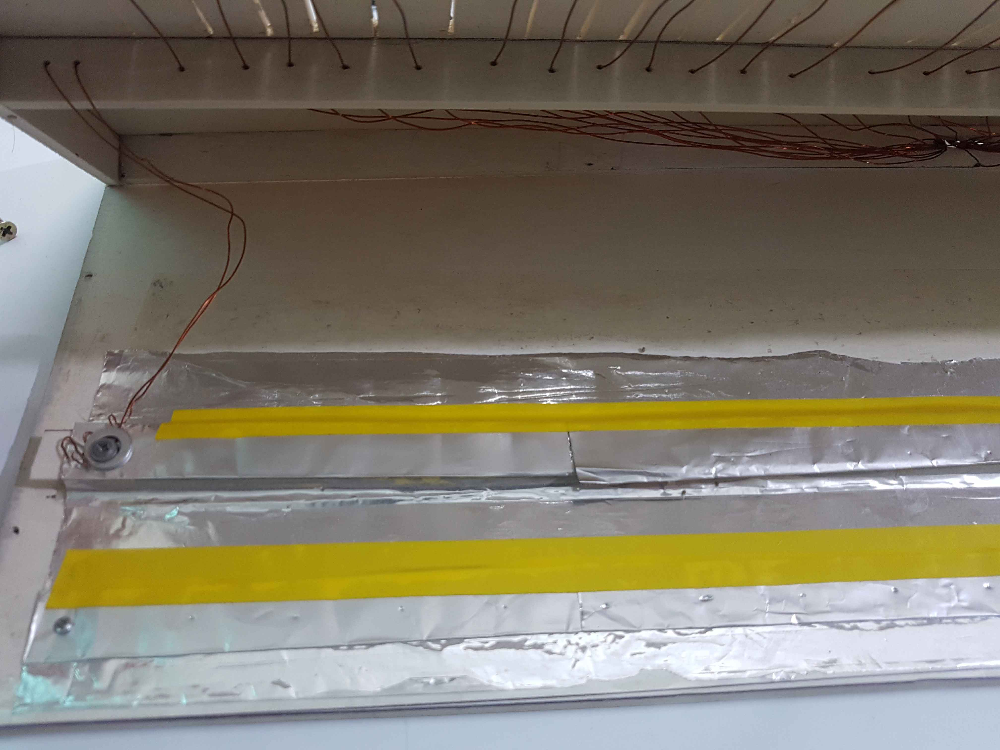
</p>

Each of the key wire is connected to Arduino DUE digital input pins.

<p align="center">
  
</p>

Arduino DUE reads the 36 keys in polling method. 
``` Arduino
 for (int i = 0; i < 36; i++) {
    t0 = millis();
    if (t0 - debouncer[i] >= debounce_time) {
      reading = digitalRead(notes[i]);
      if (reading && !state[i]) {
        state[i] = 1;
        debouncer[i] = t0;
	 sendKey(i);
      	}
      else if (!reading && state[i]) {
        state[i] = 0;
        debouncer[i] = t0;
	}
    }
  }

```
### Arduino DUE Connection with STM32 Discovery Board
Upon detection of a keypress, DUE board generates an interrupt signal and a corresponding key ID signal. The DUE board is snapped onto the Arduino header pins of the STM32 Discovery board like a generic arduino shield.
<p align="center">
  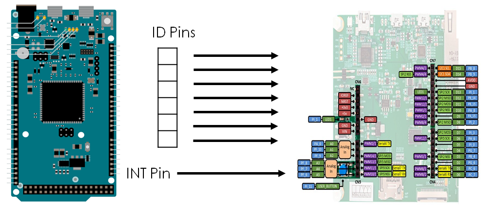
</p>

**Interrupt Generation from Arduino DUE**

``` Arduino
void sendKey(int pin){
  digitalWrite(INF[0], LOW);
  digitalWrite(IDP[0], !!(pin & 1<<0));
  digitalWrite(IDP[1], !!(pin & 1<<1));
  digitalWrite(IDP[2], !!(pin & 1<<2));
  digitalWrite(IDP[3], !!(pin & 1<<3));
  digitalWrite(IDP[4], !!(pin & 1<<4));
  digitalWrite(IDP[5], !!(pin & 1<<5));
  digitalWrite(INF[0], HIGH);
}
```

## DAC Simulation and Design Using Proteus
A simple R-2R resistor ladder DAC with 8 bit resolution was designed. This was built onto an Arduino Prototype Shield that could be easily stacked onto the STM32F7 Discovery board Arduino Compatible Headers.

<p align="center">
  
</p>


## STM32 Code

The first task is to detect a keypress interrupt and identify the key being pressed. This information is sent by the Arduino DUE board.

**Interrupt Service Routine on STM32**

``` C
void keyboard_interrupt_handler(){
  key_ID[0] = HAL_GPIO_ReadPin(GPIOA, GPIO_PIN_0);
  key_ID[1] = HAL_GPIO_ReadPin(GPIOF, GPIO_PIN_10);
  key_ID[2] = HAL_GPIO_ReadPin(GPIOF, GPIO_PIN_9);
  key_ID[3] = HAL_GPIO_ReadPin(GPIOF, GPIO_PIN_8);
  key_ID[4] = HAL_GPIO_ReadPin(GPIOF, GPIO_PIN_7);
  key_ID[5] = HAL_GPIO_ReadPin(GPIOF, GPIO_PIN_6);

  keypress = (key_ID[5]<<5) + (key_ID[4]<<4) + (key_ID[3]<<3) + (key_ID[2]<<2) + (key_ID[1]<<1) + (key_ID[0]<<0);

  read_BIN_AUDIO(keypress);	// read the corresponding audio file from SD card and save to data buffer
  update_audio_buffer();		// add the tone to the audio buffer
}
```

Inside the micro sd card, audio files are saved in binary format, each of the audio sample is of 8 bit, represented in binary form. The samples are read directly without any form of compression/decompression. The audio samples are stored onto a buffer array. <a href="https://www.youtube.com/playlist?list=PLc2rvfiptPSR0bzPjEsg5zmj0jvYMZLbV">(Tutorial on SD card handling)</a>

**Reading audio from micro sd card**

``` C
void read_BIN_AUDIO(int note)
{
	res = f_open(&myFile, audio_filenames[note], FA_OPEN_ALWAYS|FA_WRITE|FA_READ);
	res = f_read(&myFile, DATA_BUFFER, BUFF_SIZE, &bytesRead);
	f_close(&myFile);
}
```

<p align="center">
  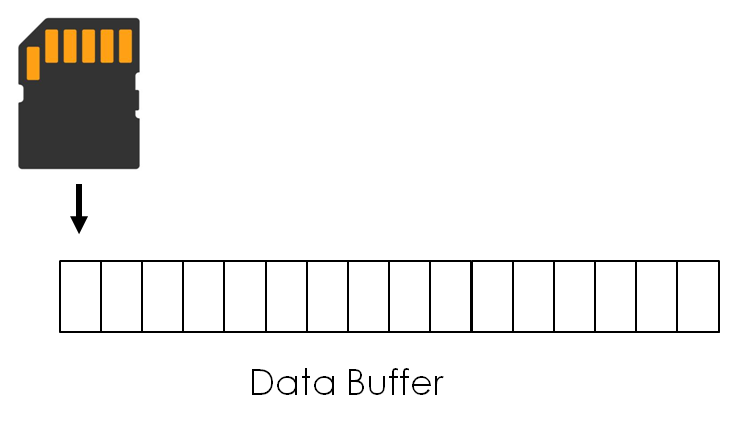
</p>

After reading the full audio file, the elements of the file buffer are copied over to the current position of the circular audio buffer.

``` C
void update_audio_buffer(){
	int idx_audio, idx_data;
	idx_audio = AUDIO_PTR + 1;	
	for (idx_data=0; idx_data<bytesRead; idx_data++){
		idx_audio = (idx_audio+1) % BUFF_SIZE;		
		AUDIO_BUFFER[idx_audio]= DATA_BUFFER[idx_data];
	}
}
```
A timer interrupt reads the audio buffer at a rate of 8kHz and outputs the audio samples via the DAC circuit.

**Timer interrupt**

``` C
void HAL_TIM_PeriodElapsedCallback(TIM_HandleTypeDef *htim)
{
	AUDIO_PTR = (AUDIO_PTR+1) % BUFF_SIZE;

	DAC_REG = AUDIO_BUFFER[AUDIO_PTR];
	AUDIO_BUFFER[AUDIO_PTR] = 127;		
	DAC_OUTPUT();
}
```

**DAC Signal Generation on STM32**

``` C
void DAC_OUTPUT(){
	HAL_GPIO_WritePin(GPIOI, GPIO_PIN_3, !!(DAC_REG & (1<<7)));
	HAL_GPIO_WritePin(GPIOH, GPIO_PIN_6, !!(DAC_REG & (1<<6)));
	HAL_GPIO_WritePin(GPIOI, GPIO_PIN_0, !!(DAC_REG & (1<<5)));
	HAL_GPIO_WritePin(GPIOG, GPIO_PIN_7, !!(DAC_REG & (1<<4)));
	HAL_GPIO_WritePin(GPIOB, GPIO_PIN_4, !!(DAC_REG & (1<<3)));
	HAL_GPIO_WritePin(GPIOG, GPIO_PIN_6, !!(DAC_REG & (1<<2)));
	HAL_GPIO_WritePin(GPIOC, GPIO_PIN_6, !!(DAC_REG & (1<<1)));
	HAL_GPIO_WritePin(GPIOC, GPIO_PIN_7, !!(DAC_REG & (1<<0)));
}
```

## Conclusion

## Team

- Mir Sayeed Mohammad (github - https://github.com/ClockWorkKid)
- Shafin Bin Hamid (github - https://github.com/shafinbinhamid)
- Ramit Dutta (github - https://github.com/RamitDutta)
- Himaddri Roy (github - https://github.com/himu587)
- Sujoy Mondal (github - https://github.com/sujoy-mondal)

